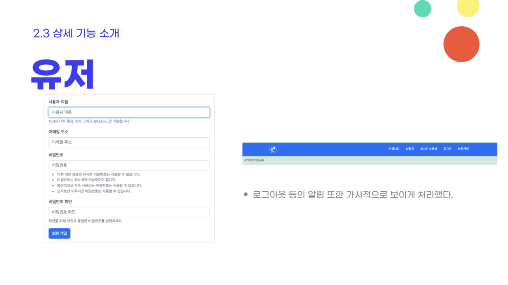
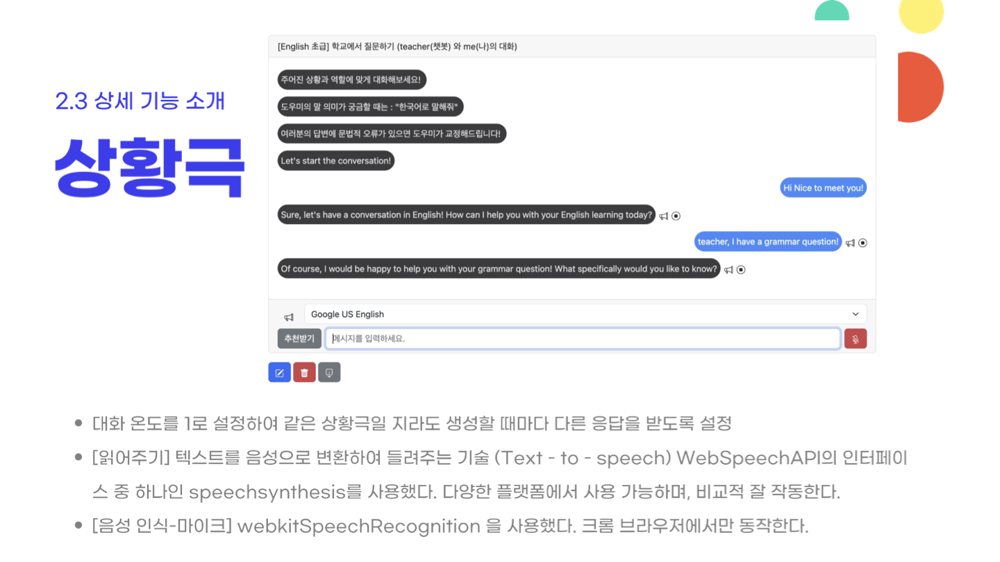

# 번역해조

## 역할

- 유저 구현
- 상황극 구현
- DB설계

## 개발 도구

- django3
- python
- mysql
- front : html, css, javascript, jquery

## 작동 방법
- openAPI key 발급받아서 .env에 작성
- 개인 mysql workbench account정보 db_settings.py에 작성
- 마이그레이션 후 로컬에서 작동

## ERD

# 상세 기능

---

## 1. 유저

## 2. 사전(메인페이지)

## 3. 단어장

## 4.상황극

## 5. 사용자간 실시간 채팅

## 6. 게시판

---

# 어려웠던 점 및 개선해야할 점

**[ 페이지 이동시 JavaScript 동적 이벤트 적용]**
하나의 페이지에서 다음 페이지로 연결 시 post되어있는 정보를 가지고 다음 페이지를 유동적으로 변화시키며 표시하면서도 동시에 해당 페이지 안에서 일어나는 동적 이벤트를 관리하는 코드를 구성하는 것이 여간 쉬운 일이 아니었다.

**[ 웹소켓 연결 끊김 문제]**
웹소켓을 연결하자마자 바로 끊기는 상황이 웹소켓 이용 앱 2개에서 모두 발생했다. 패키지 버전 충돌의 문제인지, 서버 문제인지 등 여러가지 해결방안을 찾으려했으나, 일부 컴퓨터에서는 작동하나 그렇지 않은 경우도 있어서 추가 조치가 필요하다.
**[실시간 채팅방]** 
자료들을 서로 연동하는데에 어려움을 겪었다. (DB와 웹소켓 사이)

**[전체적으로 UI개선이 필요]**
언어학습이라는 특성상 모바일에서도 쾌적한 경험이 가능해야하지만 모바일창에서의 가독성을 크게 신경쓰지 못했다
페이지를 이동하서나 클릭시의 동적 애니메이션 이벤트가 없어서 사용자 경험측면에서는 좀 밋밋하다
**[사전]** 

검색할 언어 설정에 따라 음성 인식기능을 구현하고 싶었으나 역량부족으로 제대로된 구현에 실패하였다
**[상황극]**
단어장과 연동하여 유용한 표현을 단어장에 저장하는 기능을 추가로 구현한다.
비용이 발생하기 때문에 결제 기능 구현이 추가로 필요하다.

**[실시간 채팅방]**
다양한 기능 구현에 대한 개선 필요 
현재 실시간 채팅 기능까지는 구현했으나, 추가적으로 사용자간 게임을 구현하여 사용자들의 학습 효과 및 의욕을 높이는 것이 목표이다.
**[유저]**
현재 단순 테이블로 유저 정보를 나열하고 있는데, 이를 개선해서 좀더 사용자들에게 매력적으로 보이도록 UI를 개선하고, 특히 학습 진척도(및 레벨) 부분을 강조해야한다.
streak기능 구현:  학습 출석인증을 하지 않으면 연속 열공 일자가 리셋되게 설정하는 것이 추가 구현 목표
 
 

# 느낀점

프로젝트의 주제인 외국어/사전의 특성상 데이터를 얻는 것이 어려워 데이터 수집 및 모델링에만 큰 공을 들였다. 
저작권상 API를 제공하지 않거나, 다국어(영어 중국어 일본어) 기능을 제공하는 우리 서비스에는 적합하지 않은 경우가 대부분이었다. 결국 최대한 얻을 수있는 데이터 내에서 가장 효율적으로 사용자에게 제공하는 방법을 고민하게 되었다.

처음 적용해보는 기술들 TTS(text to speech) STT(speech to text), websocket 및 배운 것에서 나아가 추가적인 기능들을 덧붙이는 것이 어려웠다.  특히 웹소켓 문제는 에러의 원인 조차 잡기가 어려울 때가 많았다.
그 가운데 여러가지 기능들을 시도하고 살을 붙여나가면서 팀원 모두가 많이 배울 수 있었던 프로젝트였다.

# 프로젝트 진행 과정

2023.10.13 ~ 2023.10.17 프로젝트 설계 및 모델링
2023.10.17 ~ 2023.10.23 프로젝트 개발
2023.10.24 ~ 2023.10.25 디버깅 및 테스트 & 발표준비
2023.10.26   최종 발표